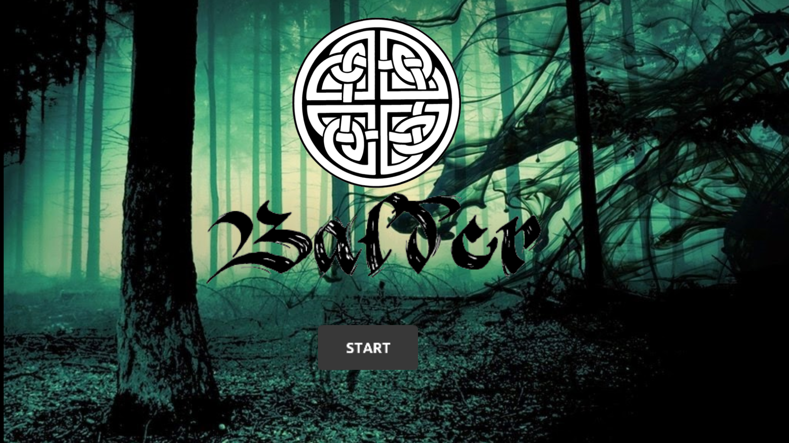
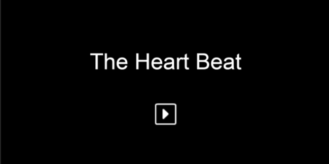

* * *
# _Bem vindo._
* * *
# _Quem sou eu:_

_Mychellangello Ruttyelly, terminei o curso programação de jogos Digitais, IFRN campus Ceará-Mirim/RN. Agora estou cursando Artes visuais na UFRN._  

### [RPP](https://mychellangello.github.io/Operacao/) ###
### _Contatos_

Email : Mychellangelloangello@gmail.com, Mychellangello@hotmail.com.   
[Facebook : Mychellangello Ruttyelly](https://www.facebook.com/mychellangello.ruttyelly/)  
[Instagram : m_ruttyelly](https://www.instagram.com/m_ruttyelly/)  

# _Portfolio_

### _Games_
***
[Carta: um jornada frágil](https://mychellangello.github.io/Carta%20uma%20jornada%20fr%C3%A1gil/)  
Parceiro:[Franklin Mateus](https://thewordkh.github.io/)

[ TDA](https://mychellangello.github.io/tdaf/)  
Parceiros: [Franklin Mateus](https://thewordkh.github.io/), [Guilherme Égle](https://guiegle.github.io/).

[ Balder](https://mychellangello.github.io/Balder/)  
Parceiro:[João Pedro](https://bixcoito.github.io/)

#### _Tutoriais_

[Multi-idiomas](https://drive.google.com/file/d/1xJXiLN-2qKVClKPrLnmwUOXI1nsXZThe/view)

Parceiros: João Pedro, Guilherme Égle.
***
### _Artes_  

#### _Influence map_  

  
#### _Trabalhos de Design Gráfico_
##### _Criação_
  
##### _Releituras_

  
  

### _Projeto Integrador (PI)_  
  
[The Heart Beat](https://bixcoito.github.io/TheHeartBeat/)

